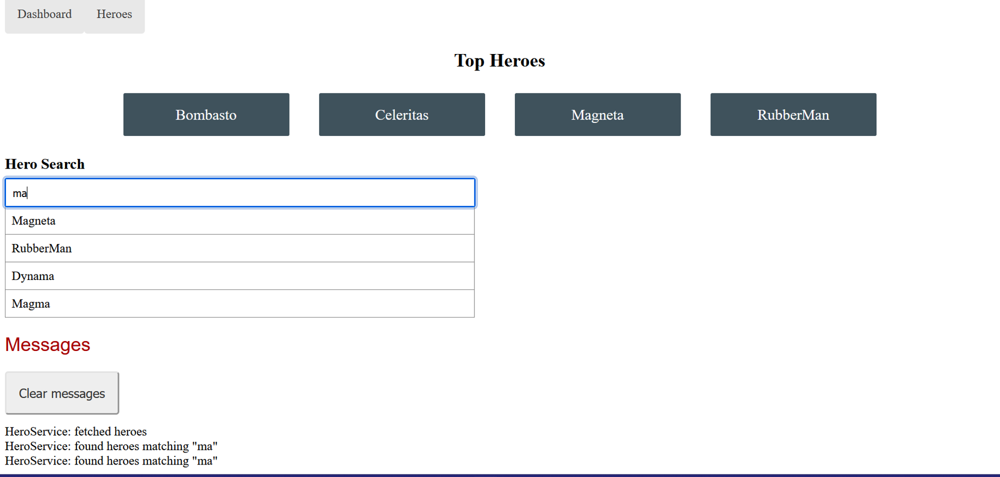

# Tour of Heroes

These are my notes as I complete the [Angular tutorial Tour of Heroes](https://angular.io/tutorial/tour-of-heroes). I do not provide full directions here, only my personal notes on what I am learning and the steps which were necessary for adapting the tutorial, written for a modular application, to the newer standalone format which is the default for Angular 17 projects. **If you are following the standalone format version, make sure to be careful copy-pasting .ts files! You need to make sure not to erase standalone: true from the component decorator!**

NOTE: the numbers of each section here do not match those in the tutorial but instead match the numbers I gave them in my commits. OOPS. To match to the right section in the tutorial, just use the name!

## 1. Create a new project

I will use the Angular 17 default and use a standalone app.

```bash
# with Angular 17 the default is a standalone app to use the old 
# modular app which is shown in the tutorial add --no-standalone to the end
ng new angular-tour-of-heroes 
```

Move into the new folder and launch the app with **ng serve.** The --open flag opens the app in your browser automatically.

The basic files for Angular are generated automatically and AppComponent is the shell the project will be displayed in - it kind of serves as a base level on to which other components will be added.

Each new compontent has four files:

- name.component.html : the HTML content for the component
- name.component.css : style to apply ONLY to this component
- app.component.ts : the TypeScript code for the class, where much of the magic happens!
- app.component.spec.ts : for tests, which won’t be part of this tutorial

In the html, we can reference variables from the same class with double curly braces: {{ variable_name }} . This is interpolation binding. 

In the tutorial we use it to show the title. 

In the src folder, we have the project-level HTML and CSS files. In the tutorial we add some CSS to it which will apply to the whole app. In the html file, we can see that <app-root></app-root> is used to add the contents of our app component to the index.html.

## 2. The hero editor

Angular apps are made up of components. The idea is to make discrete modules which have a specific purpose and may be reusable. For example, in the tutorial we have two different components for displaying heros: one for the list view and one for showing detailes of one specific hero.

To make a component we use ng generate component componentname or ng g c componentname for short.

All components import Component from the common core and use the @Component decorator to turn the class into a component. The decorator takes a dictionary that must have three elements which are automatically provided if we use ng generate to create the component:

- selector which is the name that is used for the component’s CSS and for the custom html element that will be used to add it to our webpage. Ex: app-heroes
- templateUrl: the html page for the component
- styleUrls: the css file for the component

⚠️ If, like me, you are using the new standalone version of Angular, your components will also have two more keys in the dictionary. Make sure not to delete these by copy-pasting from the tutorial! ⚠️

These elements are:

- standalone: set to true
- imports: a list of all components which are needed **in your template**, empty on initialization

In the tutorial, we generate a component called **heroes** which will be used to display the list of all the heroes.

The component class will always have export before it so that it can be used elsewhere.

The tutorial asks us to add a hero attribute to the class, use interpolation binding {{ }} to add it to the heroes.component.html file, and then use <app-heroes></app-heroes> to add it to the app.component.html file below the title. 

⚠️ If, like me, you are using the new standalone version of Angular, there is one more step. You need to import HeroesComponent into the app.component.ts file. This requires BOTH adding import { HeroesComponent } from … to the top of the page AND adding HeroesComponent to the imports list inside the @Component decorator.⚠️


Please enjoy the color scheme of my VSCode.

Next, the tutorial has us make a hero interface file in the /app folder.

> Interface is programming syntax which enforce the syntax on the class. It is the definition of the object with only types of data it must have.  … Interface in typescript is types for the object. In Type-Script interface is defined with the help of the interface keyword. … The interface is also known as structural subtyping.  - [GeeksforGeeks](https://www.geeksforgeeks.org/what-is-interfaces-and-explain-it-in-reference-of-typescript/)
> 

We will be using this interface to type our Hero objects which appear in our Heroes list, so we must import this interface into our heroes component file. We do not, however, add it to the imports list as it is not referenced in the template, but rather in the class.

We can now type our hero and change its form to match. Be careful not to overwrite the component decorator when copy-pasting from the tutorial, however the changes to the template can be copied without worry!

### |   ← ceci *est* une pipe

Now we play with a pipe! We add an uppercase pipe to our hero’s name. Pipes allow us to take the output of our variable (here, the heroe’s name) and transform it. We can even chain times together and the output of each pipe is the input of the next. Useful pipes are available for formatting dates, currency and percentages as well as imposing uppercase, lowercase, camelcase, etc.

⚠️ If, like me, you are using the new standalone version of Angular, you must import CommonModule into your component in order to use pipes. Because you are also using them in your template, add it to the Imports list in the component decorator! ⚠️

![Rememer: imports: [] is for imports your TEMPLATE needs.](./images/pipeimport.png)

Remember: imports: [] is for imports your TEMPLATE needs.

### Two-Way Databinding!

Next we want to be able to display the Hero’s name in an input field AND have the hero’s name change where it is displayed in the page. For two-way data binding, we use the format: [(ngModel)]="variable" in the input element of the template.  But before it will work, we must **import the FormsModule and add it to the import list in the component decorator.**

⚠️ If, like me, you are using the new standalone version of Angular, you must add this import to the component you will be using the two-way binding in (in this case, **heroes.component.ts**). There is no module file as referenced in the tutorial. ⚠️

In the tutorial, it says that generating our component automatically declared it in the moduel file. In a standalone-type app, this doesn’t exist. Instead, you can see that it has been added to the app.component.ts file.

## 3. Display a list

In this section, we create a file of mock-heroes to have data to display in our list. Notice that the IDs start as 12. Don’t panic later when your app does not display the first 11: they do not exist. Yes, I am speaking from experience.

After we import this list into our heroes class, we use a for loop to display it. The tutorial shows an **ngFor** method which requires you to import ngFor. **I will be using the newer method @for which has two benefits:**

- no need to import anything
- curly braces make it clearer where the for loop ends.

To declare a @for loop, simply put:
 @for( item of iterable, track item){  <p> Whatever HTML to repeat goes here and can include {{ item }} </p>} 

into your template and replafce iterable with what you want to loop over and item with a more expressive variable chocie. Notice that it is **of -** I keep trying to put in instead. 

```jsx
@for(hero of heroes; track hero) {
<li>
  <button type="button">
    <span class="badge">{{[hero.id](http://hero.id/)}}</span>
    <span class="name">{{[hero.name](http://hero.name/)}}</span>
  </button>
</li>
}
```

> The tracking function created via the `track` statement is
 used to make it easy for the Angular change detection mechanism to know
 exactly what items to update in the DOM after the input array changes. The tracking function tells Angular how to uniquely identify an element of the list. - [Angular University](https://blog.angular-university.io/angular-for/)
> 

Next we create an event listener. We do so in the html element in the template by adding the event name in parentheses and se tit equal to the function to be called, which we will then create in the component’s class. Ex: (click)=”FeedDog(dog)”.

Next the tutorial asks us to use an if statement in the heroes template to display detailes ona  hero if one is clicked. Like with for, I am going to use the more modern @if style rather than ngIf. Like @for, @if does not require an import and braces make it clear which part of the template is conditional.

```jsx
@if(selectedHero){
    <div>
        <h2>{{selectedHero.name | uppercase}} Details</h2>
        <div>id: {{selectedHero.id}}</div>
        <div>
            <label for="hero-name">Hero name: </label>
            <input id="hero-name" [(ngModel)]="selectedHero.name" placeholder="name">
        </div>
    </div>
    }
```

### Class Binding

Class binding, as the tutorial explains, allows us to add or remove a class from an element according to some boolean logic. This can be useful for changing styles or even hiding elements depending on user interaction.

The syntax is [class.some-css-class]="some-condition” added to the HTML element.

## 4. Create a feature component

In this section we will create a hero-detail component to seperate the task of displaying the list from that of displaying the detailed view of a hero. ng g c hero-detail gets us started.

Once again, I adapted the template to replace ngIf with @if:

```tsx
@if(hero){
<div>
    <h2>{{hero.name | uppercase}} Details</h2>
    <div><span>id: </span>{{hero.id}}</div>
    <div>
        <label for="hero-name">Hero name: </label>
        <input id="hero-name" [(ngModel)]="hero.name" placeholder="name">
    </div>
</div>
}
```

Notice that we take the two-way data binding and uppercase pipe previously in the heroes component, so we must import the FormModule and CommonModule into hero-detail. We can remove them from heroes where they will no longer be needed.

For this to work we must follow a few steps:

- Import our Hero template and the Input module from the angular core into our hero-details.component.ts file. Neither needs to be added to the list in the decorator, however.
- Make a hero attribute in this class with the @Input decorator to show that this is data which will be exported by the parent component. The **? means that this is an optional parameter**. IE there may be no hero.
    
    ```tsx
    @Input() hero?: Hero;
    ```
    
- Add the custom element for the hero-details class to its parent component template: heroes.component.html. *Remember to delete the old @if section which is now part of the hero-detail component.*
    
    ```jsx
    <app-hero-detail [hero]="selectedHero"></app-hero-detail>
    ```
    
    [hero]=”selectedHero” tells us that the hero parameter in the hero-detail component (the child component) gets is value from selectedHero in the heroes component. This is called property binding which is a type of one-way binding. 
    
    Note that the parent-child relationship here is NOT one of object-oriented programming inheritance. Instead it depends on which component is inserted into the other one’s template. If <app-component-A></app-component-A> is added to the app-component-B.component.html template, then B is the parent and A is the child. 
    
- ⚠️ If, like me, you are using the new standalone version of Angular, there is one more step. You must import HeroDetailComponent into heroes.component.ts AND add it to the imports list in the @Component decorator as you will be using it in the heroes template.⚠️

## 5. Add services

As the tutorial explains, “**Components shouldn't fetch or save data directly**, and they certainly shouldn't knowingly present fake data. **They should focus on presenting data and delegate data access to a service.**” To keep access to our hero data seperate from its display, we will make a hero service and provide it to the heroes class through dependency injection.

> Dependency injections are useful to create loosely coupled programs, while also following the [SOLID](https://www.techtarget.com/whatis/definition/SOLID-software-design-principles) software design principles. This helps improve the reusability of code, while also reducing the frequency of needing to change a [class](https://www.techtarget.com/whatis/definition/class), a template of the methods or variables in an object. - [TechTarget](https://www.techtarget.com/searchapparchitecture/definition/dependency-injection)
> 

Dependency injection can make code easier to maintain and test, though it can also complicate IDE auto-completion and make debugging more complex.

Frameworks like Angular have built-in methods for handling dependency injection. To take advantage of these, we’ll create a new service with the CLI by entering ng generate service hero or ng g s hero.

Now we have a shiny new hero.service.ts file inside our app folder! A look inside shows that an Injector class is set up and ready for us. We also have a hero.service.spec.ts file for testing.

We now need to import the data this service will need - in our case the Hero interface and the HEROES mock data and create a method for getting access to this data.

Then we are ready to inject the service into our Heroes component.

Now, instead of setting the value of heroes in the heroes component, we simply define what the property will look like:

```tsx
heroes: Hero[] = []
```

This sets up heroes to be ready to contain a list of Hero objects.

Now we need to inject the service by providing it to the constructor, as show in the tutorial, OR by using the inject() method:   `private heroService = inject(HeroService);` inside of the class. I will simply follow the tutorial here as it is the most common method.

As the tutorial explains, either method creates a private attribute which contains a Singleton instance of the service.

Next we define a getHeroes() method which uses this service to set the heroes attribute and then we call it in the ngOnInit() function which runs anytime the class is instanciated. 

The tutorial explains that at this stage getHeros() is written as though it is a synchronous function, meaning we expect to get the result immediately and none of the rest of the code can continue until we do. This works for now with our mock data, however if we are using a real application and sending HTTP requests for the data, we need this to be asynchronous. This means that the rest of the code can continue, loading other components in the page for example, while we wait for the data to arrive.

### Making it asynchronous

To do this, we will change the service to return an Observable.

> An Observable is a function that can return a stream of values to an Observer over time, either synchronously or asynchronously. The data values returned can go from zero to an infinite range of values. - [LogRocket](https://blog.logrocket.com/guide-rxjs-observables/#what-observables)
> 

We must first import Observable into our service and then refactor the getHeroes() function. Let’s look at the new verison:

```tsx
getHeroes(): Observable<Hero[]> {
  const heroes = of(HEROES);
  return heroes;
}
```

We type the return of the function by showing that it is an Observable which returns a list (stream) of Heroes as its value. Later, we will use an HTTP request to get our list of heroes, but for now we simply use our mock data held in HEROES and use of( ) to turn it into an observable.

Next we must adapt our getHeroes() function in our heroes class to accept an observable. Let’s look at the new version:

```tsx
getHeroes(): void {
  this.heroService.getHeroes()
      .subscribe(heroes => this.heroes = heroes);
}
```

this.HeroService tells us that we are using the heroService attribute of the instance which we created through dependency injection and we are calling the getHeroes() method we refactored above. Because that method now returns an observable, we can subscribe to it - ie we listen for the function to return its values and when it’s finished we can transform or use them according to the callback function that follows.

**In this case, the heroes is the data returned by this.heroService.getHeroes() and we use it to set** the heroes attribute of our instance.

Our function is now asynchronous meaning that if our HTTPRequest is slow it won’t hold up the rest of the page.

### Message Service

Now we will practice components and services more by creating a message component to display a message at the bottom of the page and a service to handle these messages.

We generate the component and add it to the app.component template. 

- ⚠️ If, like me, you are using the new standalone version of Angular, remember to import MessagesComponent into the app component and add it to the imports list in the component decorator. This is required before you can use it in the app template!⚠️

Next we make the message service and we can copy pasta the code from the tutorial. None of it is too confusing.

This is where the service inception begins: we inject the message service into the hero service. Sounds scary but really it’s just 3 steps:

1. Import the MessageService at the top of the hero.service.ts file.
2. Inject it into the hero service by adding it to the constructor function.

```tsx
constructor(private messageService: MessageService) { }
```

1. Use it in the getHeroes() function to add a message to the message service everytime the getHeroes() function is called

### Display the Message from HeroService

Next we follow the tutorial and copy/paste to import the MessageService into our Messages component, inject it into the constructor, and display messages in the template. Again, I edited the template to use @for and @in instead of ngFor and ngIn as I find them clear. You can see in this example that we can nest them.

```tsx
@if(messageService.messages.length){
<div>
    <h2>Messages</h2>
    <button type="button" class="clear" (click)="messageService.clear()">
        Clear messages
    </button>
    @for(message of messageService.messages; track message){
    <div> {{message}} </div>
    }
</div>
}
```

Unlike with components, services do NOT need to be put in the imports list of the constructor to be used in the template.

### Add MessageService to HeroesComponent

In this section we make changes to display a message anytime a hero is clicked into the existing one which tells us when the heroes list is fetched. Remember, if you are using a standalone app be careful not to copy/paste the whole .ts file as you will replace necessary components of the @component decorator (standalone and inputs).

First, import MessageService into the Heroes component. We can delete the old HEROES import if you haven’t already; we no longer use it to access our heroes as we pass by the service instead.

Next, we need to inject the service into the constructor function of our HeroesComponent.

Finally, we add a line to the onSelect() method which adds a message to the MessageServices list of messages anytime a hero is clicked.

```tsx
this.messageService.add(`HeroesComponent: Selected hero id=${hero.id}`);
```


Result!

Make sure you’ve added the CSS styling for the messages component and you’ve wrapped up this section!

## 6. Add navigation with routing

Routing is simply directing traffic within your application. For example, if you click on your Spam folder in your webmail account, the app needs a route to use to be able to find the right data and load your Spam folder instead of showing you your Drafts. These are what we see in the browser as we navigate the web. 

First, we will create a navigation bar to propose different views to the user.

⚠️ If, like me, you are using the new standalone version of Angular, this section will require you to deviate significantly from the tutorial. We are NOT using modules, so you should not create a routing module. Instead, you already have a routing file waiting for you in your project. Follow along with the directions below!⚠️

1. Open the app.routes.ts file in your app folder. You will see that it as a const routes parameter, just like what is shown in the module file in the tutorial. Import your HeroesComponent and add the path here as shown in the tutorial. 
    
    ```tsx
    import { Routes } from '@angular/router';
    import { HeroesComponent } from './heroes/heroes.component';
    
    export const routes: Routes = [{ path: 'heroes', component: HeroesComponent },];
    ```
    
    The path is what will go in your url bar when you want to see the Heroes component. It will come AFTER your root address, which for most websites will simply be the full domain name. Ex: www.google.com/PATH-HERE . In this case, when ng serve is running,  http://localhost:4200/heroes will show the HeroesComponent in your app (after we finish setting up routing! Patience!).
    
2. Add the router-outlet to your app component template, as shown in the tutorial. The resulting app.component.html file should be:
    
    ```tsx
    <h1> {{title}} </h1>
    <router-outlet></router-outlet>
    <app-messages></app-messages>
    ```
    

Now, navigating to [localhost:4200](http://localhost:4200)/heroes should show your heroes page while localhost:4200 should only show the title.


### Linking to Router Paths

To link to the paths we create this way, we do not use href as we usually expect in HTML. Instead, we use routerLink=”/path-here” inside the a element. We will add the following navigation bar to the app component template:

```tsx
<nav>
    <a routerLink="/heroes">Heroes</a>
</nav>
```

⚠️ If, like me, you are using the new standalone version of Angular, you also need to add an import to your AppComponent. In the app.component.ts file, import RouterModule from @angular/router (you should already have a RouterOutlet import, you can add RouterModule to the same line: import { RouterModule, RouterOutlet } from '@angular/router'; AND add it to the imports list in the @component decorator so that it is available to the template! Now you are ready to navigate away! ⚠️

Make sure to update the app component CSS file so that your nav menu isn’t early ‘90’s style!

### Add a dashboard view

Here we will make a new component to have a dashboard, or home view, which will display the top 5 heroes. ng g c dashboard gets us started!

Again, I edited the code to use @for instead of ngFor:

```tsx
<h2>Top Heroes</h2>
<div class="heroes-menu">
    @for(hero of heroes; track hero){
    <a>
        {{hero.name}}
    </a>
    }
</div>
```

There’s nothing wrong with ngFor, of course, just remember to import CommonModule!

If you are using the standalone version of Angular, make sure to be careful copying the dashboard.component.ts file: keep the @Component decorator which ng g c made for you and don’t copy/paste the smaller one from the tutorial!

### Add the dashboard route and a default view

⚠️ If, like me, you are using the new standalone version of Angular, you don’t have a routes module; follow the directions below instead.⚠️

Just as we did for heroes, open the app.routes.ts file and import the DahsboardComponent.

Add the “dashboard” path and default route as show in the tutorial. Your file should look like this:

```tsx
import { Routes } from '@angular/router';
import { HeroesComponent } from './heroes/heroes.component';
import { DashboardComponent } from './dashboard/dashboard.component';

export const routes: Routes = [{ 
    { path: '', redirectTo: '/dashboard', pathMatch: 'full' },
    { path: 'dashboard', component: DashboardComponent }, 
    { path: 'heroes', component: HeroesComponent },];
```

The redirect means that anyone navigating to your root-level (your main domain), will be shown the dashboard view. Now, we just need to add an a element with routerLink=”/dashboard” to our nav bar and we’re ready to hop around the app!

### Navigating to hero details

Next we seperate the detail view from the heroes view. This way it will have its own route and be more visible when the user wants it rather than hidden at the bottom of a long list of heroes. 

We can mostly follow the directions in this section ⚠️ If, like me, you are using the new standalone version of Angular, just remember that your routes are in app.routes.ts⚠️ 

Important to remember: we use : to indicate a placeholder for a more specific parameter that will be provide dynamically. Here we use it in the detail route “/detail/:id” to show where the hero’s ID will be given to get the right hero info.

As usual, I kept the @for when the tutorial updates the dashboard links. Of course ngFor is also fine!

⚠️ If, like me, you are using the new standalone version of Angular, import RouterModule into the dashboard component and the heroes component (including the import list) for routerLink to work in each template! ⚠️ 

```tsx
<h2>Top Heroes</h2>
<div class="heroes-menu">
    @for(hero of heroes; track hero){
    <a routerLink="/detail/{{hero.id}}">
        {{hero.name}}
    </a>
    }
</div>
```

Getting the right hero’s ID in the loop is called interpolation binding.

We do the same with the heroes template, making sure to import RouterModule as mentioned above. Again, I keep the @for loop:

```tsx
<h2>My Heroes</h2>
<ul class="heroes">
    @for(hero of heroes; track hero.id){
    <li>
        <a routerLink="/detail/{{hero.id}}">
            <span class="badge">{{hero.id}}</span> {{hero.name}}
        </a>
    </li>
    }
</ul>
```

We can delete the now-unnecessary selectedHero and onSelect attributes from the heroes component and now all we need to do is make the changes necessary for the detail view to get the ID from the router and not from the heroes component.

### Inject some services!

To get the paramter from the route and use it in our code, we import and inject 3 services into our detail component: ActivatedRoute, HeroService, and Location.

HeroService we made ourselves, so we know what it does: it gets hero data for us.

ActivatedRoute lets us extract information from the current route including parameters, the URL, the title, and the path from the root.

Location: this also lets us get info from the url and importantly normalizes it according to our root path and we use it to get the previous page for the go back button function.

Then we can follow the tutorial to add getHero() to our HeroService, add a getHero() function to our detail component, and importantly call it in the ngInit function so that the hero information is gathered as soon as an instance of the view is created.

In these functions, notice that we use asynchronous functions with subscribe.

Finally, we add a go back button that uses the back method of Location to be able to return to the view we came from. To test this, go to the dashboard, click on a hero, and click back. You return to the dashboard. Now click on heroes, select a hero, and click back. You go back to heroes. Magic!

**Make sure you updated the dashboard compenent CSS and this section is DONE!**

## 6. Get data from a server

In this section, we learn to use HTTPClient to make requests to web servers. This is what we will use to communicate with our Django API in our class project. However, for this demonstration, we will also add a module which *simulates* an API. This is only to allow us to practice HTTPClient without needing to setup a seperate server. 

⚠️ If, like me, you are using the new standalone version of Angular, much of this section is different. I will describe here each step to set up the fake server and add HTTPClient to the app. ⚠️ 

Just as in the tutorial, use the command line to install angular-in-memory-web-api and create an InMemoryData service. Rememeber: we do NOT need this for our Django project, only to create a fake API for this tutorial.

```bash
# install the module
npm install angular-in-memory-web-api --save

# create the service in our app
# this creates an in-memory-data.service.ts file and a spec.ts file for testing
ng generate service InMemoryData
```

Now, copy and paste the code given in the tutorial into the in-memory-data.service.ts file.

In your app.component.ts file, import HTTPClientModule AND make sure it is in the list of imports in your component decorator .

Open your app.config.ts file and update it so that it looks like this:

```tsx
import { ApplicationConfig, importProvidersFrom } from '@angular/core';
import { provideRouter } from '@angular/router';
import { HttpClientInMemoryWebApiModule } from 'angular-in-memory-web-api';
import { InMemoryDataService } from './in-memory-data.service';
import { routes } from './app.routes';
import { provideHttpClient } from '@angular/common/http';
export const appConfig: ApplicationConfig = {
  providers: [provideRouter(routes), provideHttpClient(),
  importProvidersFrom(HttpClientInMemoryWebApiModule.forRoot(InMemoryDataService))]
};
```

ApplicationConfig, provideRouter and routes should already be there. ApplicationConfig was there by default and is what makes this file function as the configuration for our app. provideRouter and routes are what allows the routes we created earlier to function. 

providers: holds a list of service providers for our application. provideRouter(routes) which allows us to use the routes we defined, provideHttpClient() which will allow us to use the HttpClientModule for making HTTP requests to our api, and lastly we import more providers from the InMemoryWebApiModule. Again, this is only necessary to make our fake API function: we will **not** need it once we communicate instead with our real DjangoAPI. What this does is intercept our HTTP requests and use the InMemoryDataService we created to handle them.

⚠️ If, like me, you are using the new standalone version of Angular, make sure you completed the above steps!⚠️ 

### Heroes and HTTP

We can follow this section as shown in the tutorial.

Note that when we set the URL private heroesUrl = 'api/heroes'; , the api/ part is a convention used by the InMemoryWebApiModule to signal that it should intercept and handle these requests. When we are using a real webserver, we will put it’s root address. For example private heroesUrl = 'https://10.10.127.35:8080/heroes'; .

### Get Heroes with HTTPClient

Again, we can follow the tutorial. But a few notes:

```tsx
/** GET heroes from the server */
getHeroes(): Observable<Hero[]> {
  return this.http.get<Hero[]>(this.heroesUrl)
}
```

we use Observable<Hero[]> to indicate that the getHeroes function will return an observable which will be an array of Hero objects as defined by the Hero interface we created.

Previously, we used of() to transform our HEROES list into an observable. Now, we are using the HttpClientModule get method which returns an observable automatically. 

When we injected the HttpClientModule into our Hero service, we named the parameter http, so remember that http is refering to HttPClientModule and gives us access to the methods of the module including get for making http get requests. 

Note that the example in this tutorial returns a simple JSON array, however our API will return more complex objects. We will have to use the map() operator to process these observables to extract the information we need.

### **Error handling**

We can also follow this section as given in the tutorial. The error handling function is a bit complex though: get ready for more inception!
`catchError()`passes the error to a function. Which function ? If you said “handleError” you were *close*, but actually it doesn’t pass the error to handleError… it passes it to the function which is **returned** by handleError. 

 Let’s take a closer look:

```tsx
private handleError<T>(operation = 'operation', result?: T) {
  return (error: any): Observable<T> => {

    // TODO: send the error to remote logging infrastructure
    console.error(error); // log to console instead

    // TODO: better job of transforming error for user consumption
    this.log(`${operation} failed: ${error.message}`);

    // Let the app keep running by returning an empty result.
    return of(result as T);
  };
```

We create a function called handleError and specify that it will return a result of <T>. Remember: <T> is a generic type. We use it to allow our code to be reused by many different functions which may expect different results. We are simply saying handleError will return *something.* We will see in the next section how we can specify a type when calling it which will tell us what the return of the function within a function should be…
handleError takes two parameters: the name of the function (ie operation) that caused the error, which has a default value of “operation” if the name is not provided, and result. Result is optional (? tells us this) and has a generic type T. This allows us to handle errors for functions which expect alls sorts of returns: arrays, objects, strings, instances of books (🤢)….

Now let’s look at the funciton it returns:

```tsx
(error: any): Observable<T> => {

    // TODO: send the error to remote logging infrastructure
    console.error(error); // log to console instead

    // TODO: better job of transforming error for user consumption
    this.log(`${operation} failed: ${error.message}`);

    // Let the app keep running by returning an empty result.
    return of(result as T);
  };
```

This function takes just one parameter: the error that catchError will pass to it.

It will log that error to log files, add a message to our messageService (using the this.log function) which will display on the page (remember, we set this up earlier! So far it only shows us the Heroes fetched messages but can now include errors), and finally returns a result. The result is an observable (thanks to the of function!) which emits the innocuous result that was provided in handleError’s parameter, if one was provided, or undefined if no result was specified. 

When we use this in our code, we call handleError(”getHeroes”, []) so our function returns an observable which emits an empty array. This keeps our app from crashing, but uses the message and logs to indicate that there was an error.

### Tap into the Observable

This section uses .tap() which allows us to look at the values of the Observable and pass them along without transforming them. Here we simply use it to display a message indicating that the values (heroes) were found, ie our HTTP request worked. 

We added       `tap(_ => this.log('fetched heroes')),` to our pipe. The _ is a convention used to show that the argument is not being used, it is simply a place holder. 

### Get hero by ID

This lets us get a fresh look at our Error-handling inception.

Look at our new getHero() function:

```tsx
getHero(id: number): Observable<Hero> {
    const url = `${this.heroesUrl}/${id}`;
    return this.http.get<Hero>(url).pipe(
      tap(_ => this.log(`fetched hero id=${id}`)),
      catchError(this.handleError<Hero>(`getHero id=${id}`))
    );
  }
```

when we call handleError, we specify the type <Hero>. This tells our code that the result of the function which is the return of handleError should return an observable with a Hero type object. 

### Update Heroes

We can follow this section of the tutorial as-is.

A few notes, however:

- we use event binding with the save button: `(click)="save()"` remember that click is the type of event and save() is the function to call when the event happens. save() must be defined in the class our template belongs to.
- Save calls updateHero which we create in the hero service file. Notice that this function returns an observable - it is an asynchronous function. We subscribe to this observable meaning we watch for it to finish, and when it does we call a function which returns us to the previous page where we can see that our hero is updated.
- In our service file, we add
    
    httpOptions = { headers: new HttpHeaders({ 'Content-Type': 'application/json' }) };
    
    In the HTTP protocol, put and post requests **require** a Content-Type to be defined. We didn’t need this in the get request because we are not sending data, only asking for it.
    
- updateHero uses our HTTPClient (which we refer to with the attribute http) to make a put request:  `this.http.put(this.heroesUrl, hero, this.httpOptions)`  . It provides the URL to use, the hero information to update, and the HTTP options to make sure the Content-Type is included in the request. Remember that **put** will look at what changed in the hero’s data and update it.

Go ahead and test updating a hero.


A much better hero name than Bombasto.

### Add a new hero

Again, we can follow the tutorial as-is. Isn’t that lovely? 

There are a few interesting things to note. First, let’s look at our HTML template for adding a hero:

```html
<div>
  <label for="new-hero">Hero name: </label>
  <input id="new-hero" #heroName />

  <!-- (click) passes input value to add() and then clears the input -->
  <button type="button" class="add-button" (click)="add(heroName.value); heroName.value=''">
    Add hero
  </button>
</div>
```

On the input element, we have #heroName. This is called a template reference variable and allows us to refer to the element and access its valeues, as we can see on the button event binding function where we pass heroName.value as a parameter to the add function. Notice we also reset the value to an empty string so that after our hero is added the input is cleared.

Next we create the add() function in our heroes component class:

```tsx
add(name: string): void {
  name = name.trim();
  if (!name) { return; }
  this.heroService.addHero({ name } as Hero)
    .subscribe(hero => {
      this.heroes.push(hero);
    });
}
```

Notice we use .trim() to strip away white space in case the user put a space before and/or after the name. If no name was provided we return nothing. Otherwise we use as Hero to send the name as a Hero object to the addHero() function we are about to create in our hero service. We can already tell that this function will return an observable because here we subscribe to it. 

Our addHero function will send a POST request to add our hero to our database and when it completes (after it gets a 201 Created HTTP response, normally) the callback function passed to subscribe() will execute. This function adds our new hero to the heroes list to display on our page. This is more efficient than executing a new HTTP get to the database for the updated list.

Lastly, we add our addHero function to the hero service to send the POST data to our database.

```tsx
/** POST: add a new hero to the server */
addHero(hero: Hero): Observable<Hero> {
  return this.http.post<Hero>(this.heroesUrl, hero, this.httpOptions).pipe(
    tap((newHero: Hero) => this.log(`added hero w/ id=${newHero.id}`)),
    catchError(this.handleError<Hero>('addHero'))
  );
}
```

Remember, like PUT, POST requires us to specify the data format we are sending with the Content-Type attribute we put in httpOptions. Here, our tap() function doesn’t use the _ , but instead uses our newHero as a parameter so that we can log the details of the Hero we created. We only sent a name, so the database should return a 201 response with the full hero object including the ID it was assigned.

**That’s it, you can add all your own heroes now! Next we will add the functionality of deleting your heroes, in case you ever have the misfortune of meeting yours.**

### Delete a hero

Again, we can simply follow the tutorial. We first add a button with another (click) listener and this time we call a function called delete() and pass it the hero we want to remove. So, logically, we also need to create this function in the corresponding class in heroes.component.ts .

If you are using the @for style, be careful to copy-paste only the button and not the whole template or you will need to import CommonModule for the *ngFor to work.

Let’s look at our delete function:

```tsx
delete(hero: Hero): void {
  this.heroes = this.heroes.filter(h => h !== hero);
  this.heroService.deleteHero(hero.id).subscribe();
}
```

First, we use filter to remove the fallen hero from our heroes list so that it will no longer display in our template. The filter looks through the list and returns all of those which are not equal to the deleted hero.

Next, we call deleteHero() from our hero service - you guessed it, we’ll make that next! ignore your IDE’s pouting for the moment - and pass it the id of the hero to remove. Notice something interesting about deleteHero() ? It’s asynchronous, you say? That’s right! And we know because we follow it with .subscribe(). 

What is the point of subscribe() with no callback ? 🤔

The tutorial explains that without subscribing to an observable, the action is never set in motion. So if we don’t subscribe, our delete request never sends.

Let’s look at the deleteHero() method we add to our service next and we’ll see the HttpClient request in question:

```tsx
/** DELETE: delete the hero from the server */
deleteHero(id: number): Observable<Hero> {
  const url = `${this.heroesUrl}/${id}`;

  return this.http.delete<Hero>(url, this.httpOptions).pipe(
    tap(_ => this.log(`deleted hero id=${id}`)),
    catchError(this.handleError<Hero>('deleteHero'))
  );
}
```

Nothing too surprising here, it looks very much like our PUT method form earlier. I’m not sure why it includes the httpOptions as delete requests do not require a content-type method (because no body is sent, only parameters in the URL are sent) and from my tests of this application it works fine without it …

### Search by Name

We are almost finished! Just one more functionality to add: a search bar to find a hero by name. 

First, we need to create a search function in our hero service to send the HTTP get requests to our database. 

```tsx
/* GET heroes whose name contains search term */
searchHeroes(term: string): Observable<Hero[]> {
  if (!term.trim()) {
    // if not search term, return empty hero array.
    return of([]);
  }
  return this.http.get<Hero[]>(`${this.heroesUrl}/?name=${term}`).pipe(
    tap(x => x.length ?
       this.log(`found heroes matching "${term}"`) :
       this.log(`no heroes matching "${term}"`)),
    catchError(this.handleError<Hero[]>('searchHeroes', []))
  );
}
```

Notice we again .trim() the input to remove any unnecessary whitespace. We use the get method of our HttpClient and tell it we expect an array fo Hero objects. Notice the end of the URL now includes the search parameters: we are looking for a name that includes the term the user got. This should look familiar: it’s like our Django filters where we will have search options such as “school__icontains=SEARCH_TERM”.

We pipe the result of this HTTP get request to a tap() function which uses log to add a message to our MessageService list. This will show on our page whether or not we found results, just as it currently shows when heroes are fetched. It contains a condensed IF statement:

- x represents the array of results from our get request
- if x has a length (meaning we found results), we add the message “found heroes matching” with the search term to our message list
- ELSE we add the message “no heroes matching” the search term

And again we use our handleError method in case of errors and tell it that in case of an error it should return an empty array and log that there was an error in searchHeroes.

Next we create a component for our search bar using ng g c hero-search and then add the custom element <app-hero-search></app-hero-search> to the bottom of our dashboard template.

⚠️ There’s one more thing we need to do, if you are using the standalone version of Angular… do you remember what it is? …. if you answered, “I don’t have a fudging clue!” then that’s fair. There’s a lot to remember.  If you answered “import it into the dashboard.component.ts file AND put it in the import list of the decorator, then that’s right! Do it now. ⚠️

Now we can copy-paste the search template into our hero-search.component.html page. Again, I replace *ngFor with  @for. Either way, we will need to import CommonModule into our hero-search file and add it to the inputs list in the decorator because it is required for async to work in the standalone version!

```tsx
<div id="search-component">
    <label for="search-box">Hero Search</label>
    <input #searchBox id="search-box" (input)="search(searchBox.value)" />

    <ul class="search-result">
        @for(hero of heroes$ | async; track hero){
        <li>
            <a routerLink="/detail/{{hero.id}}">
                {{hero.name}}
            </a>
        </li>
        }
    </ul>
</div>
```

Notice that we once again use a template reference variable with #searchBox which lets us refer to an element and access its values. We have another event binding function, but this time the type of event has changed and we are using input. When input is received we call the search() function which we will create in our hero-search class in a moment and pass it the value of the input element which we reference with #searchBox.

We then use a for loop to display the results. Remember that $ at the end of a variable indicated an Observable. We use the async pipe to subscribe to the heroes$ observable. If we don’t use this pipe, we would have to subscribe to it in our class. Remember, if we don’t subscribe the HttpClient request is never sent!

Next, we need to set up our hero-search.component.ts file and remember:

⚠️ If you are using the standalone style of Angular, be careful copy-pasting! Don’t replace the entire @Component decorator. Also, make sure that you import CommonModule so that the async pipe works. ⚠️

```tsx
import { Component, OnInit } from '@angular/core';
import { CommonModule } from '@angular/common';
import { RouterModule } from '@angular/router';
import { Observable, Subject } from 'rxjs';

import {
  debounceTime, distinctUntilChanged, switchMap
} from 'rxjs/operators';

import { Hero } from '../hero';
import { HeroService } from '../hero.service';

@Component({
  selector: 'app-hero-search',
  standalone: true,
  imports: [CommonModule, RouterModule],
  templateUrl: './hero-search.component.html',
  styleUrl: './hero-search.component.css'
})
export class HeroSearchComponent implements OnInit {
  heroes$!: Observable<Hero[]>;
  private searchTerms = new Subject<string>();

  constructor(private heroService: HeroService) { }

  // Push a search term into the observable stream.
  search(term: string): void {
    this.searchTerms.next(term);
  }

  ngOnInit(): void {
    this.heroes$ = this.searchTerms.pipe(
      // wait 300ms after each keystroke before considering the term
      debounceTime(300),

      // ignore new term if same as previous term
      distinctUntilChanged(),

      // switch to new search observable each time the term changes
      switchMap((term: string) => this.heroService.searchHeroes(term)),
    );
  }
}
```

The tutorial does a good job describing all of the complex components in this class. Remember that the ! in heroes$! indicates that heroes$ will not be null when it is used. 

Subject is a new concept here and comes from RxJS. Here is some description from the RxJS doc:

> What is a Subject? An RxJS Subject is a special type of Observable that allows values to be multicasted to many Observers. While plain Observables are unicast (each subscribed Observer owns an independent execution of the Observable), Subjects are multicast.A Subject is like an Observable, but can multicast to many Observers. Subjects are like EventEmitters: they maintain a registry of many listeners.Every Subject is an Observable. Given a Subject, you can subscribe to it, providing an Observer, which will start receiving values normally. From the perspective of the Observer, it cannot tell whether the Observable execution is coming from a plain unicast Observable or a Subject. Internally to the Subject, subscribe does not invoke a new execution that delivers values. It simply registers the given Observer in a list of Observers, similarly to how addListener usually works in other libraries and languages. Every Subject is an Observer. It is an object with the methods next(v), error(e), and complete(). To feed a new value to the Subject, just call next(theValue), and it will be multicasted to the Observers registered to listen to the Subject. [- RxJS Doc](https://rxjs.dev/guide/subject)
> 

We use a pipe of RxJS methods to optimize the search. We start with debounce(300) which we saw in class. This doesn’t start a new search unless the specified amount of time has passed without a new event arriving. IE the user stops typing for at least 300 milliseconds.

distinctUntilChanged() ignores a new search term if it is the same as the last one. Imagine for example a user who has typed “Fra”, let 300 milliseconds pass, then they typed “nc” and deleted it quickly to return to “Fra”. There is no need to re-send the request.

Finally, switchmap is used to ignore any previous requests and only return the results of the latest requests.

Each time a user enters input, the search() function uses next() to add it to the searchTerms subject, which emits it to its listener: the pipe in our ngOnInit function. 

Copy and paste the hero-search.component.css style and you’ve made it!



The real Heroes are the people who made autocomplete on our IDE and ChatGPT. Bless them.